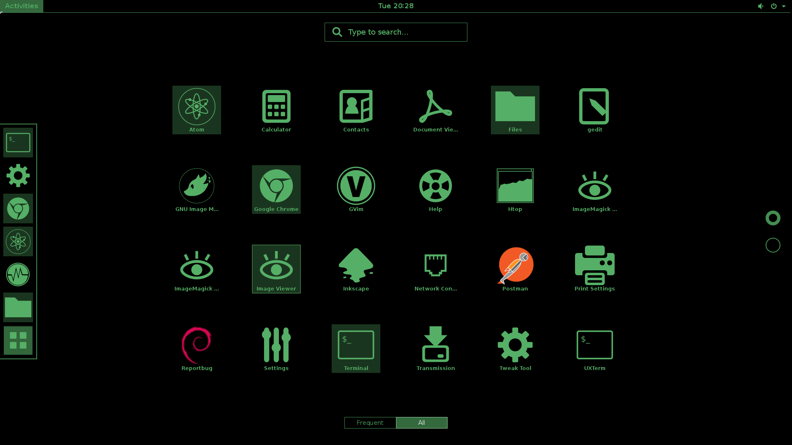

# venom

[](https://travis-ci.org/kevin-leptons/venom)

This is `mono-color`, `high-contrast` themes for `GNOME-3.14`

# Usage

Download package here

- [venom_0.0.2-0_all.deb](https://drive.google.com/open?id=0B6Eqm2oY7b1vQVNsSmxmelAzWkE)
- [venom_0.0.3-0_all.deb](https://drive.google.com/open?id=0B6Eqm2oY7b1vTVpuSjUzVTN1ZGM)

Then follow instructions

```bash
# Install
sudo dpkg -i venom_0.0.3-0_all.deb

# Active green theme
venom active venom-green

# Or active teal theme
venom active venom-teal

# Or active orange theme
venom active venom-orange
```

# Contributions

Contribute manual [here](doc/dev.md)

# Screen shoots

## venom-green



## venom-teal


## venom-orange


